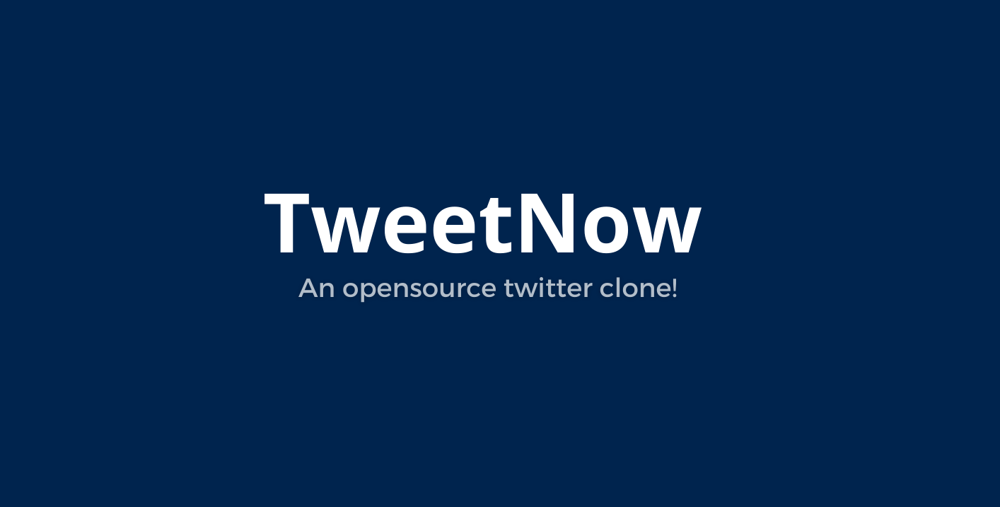

# TweetNow

TweetNow is a opensource social media created with Vue.js+Inertia SSR and Laravel. It is a social media platform that allows users to post short messages, follow other users, and engage in conversations through comments and likes.



## Features

- login and registration
- Profile editing
- More changes and features on the way.

## Technologies Used
This project is a web application built with Laravel, utilizing Vue.js and Inertia.js for a modern frontend experience.

## Getting Started

These instructions will guide you to set up a local development environment for TweetNow.

### Prerequisites
- PHP 8.1
- Node.js: Make sure Node.js is installed on your system. ( v18.12.1 )
- Composer: Make sure Composer is installed on your system.
- MySQL: Install and set up a MySQL database server.


### Installation

1. Open a terminal and navigate to the './src/' folder.

2. Install PHP dependencies using Composer:

   ```bash
   composer install
   ```
3. Generate an application key:

    ```bash
    php artisan key:generate
    ```
3. Give database credentials to '.env' file and Migrate tables to database by running the below command:

   ```bash
   php artisan migrate
   ```
3. Seed a the database:

   ```bash
   php artisan db:seed
   ```

4. Install JavaScript dependencies using npm:

   ```bash
   npm install
   ```

5. In a separate terminal run:

   ```bash
   npm run dev
   ```

6. In another terminal run:

   ```bash
   php artisan serve
   ```

   The application should start at this link: http://127.0.0.1:8000/

   If you have seeded the database then you can use this test user credential for testing and development:
   ```
   johndoe@example.com
   password
   ```

## Contribute in this repository
Comming sonn ...