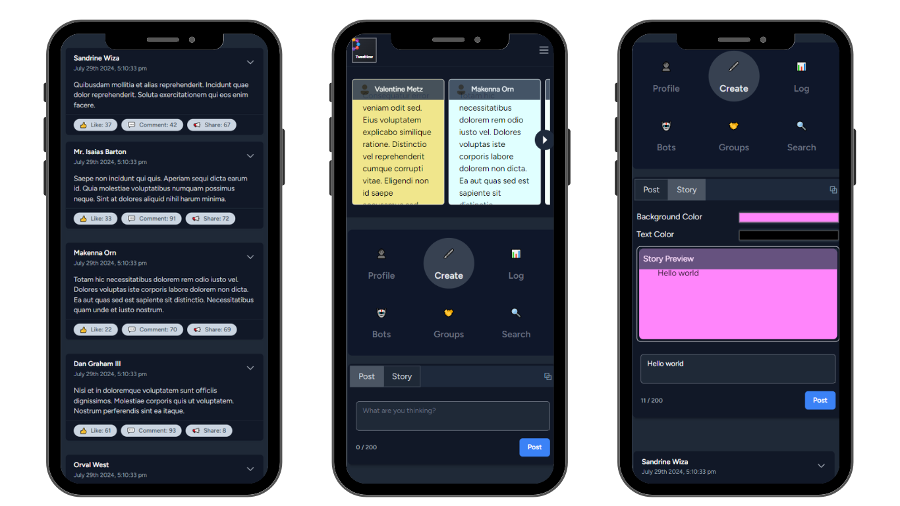
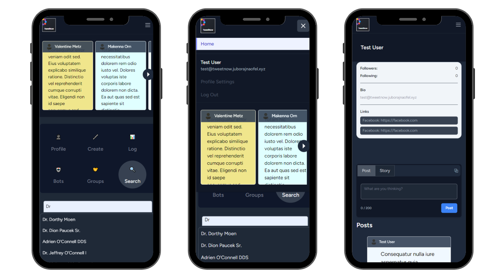
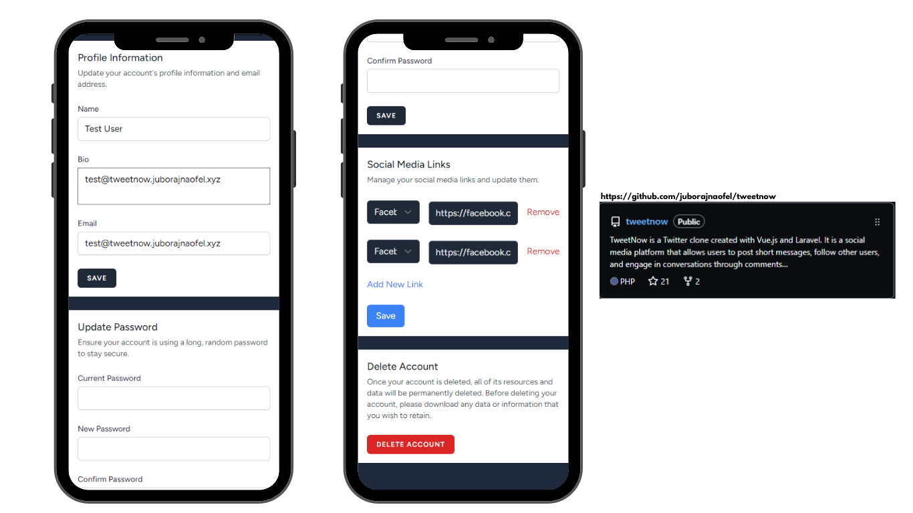
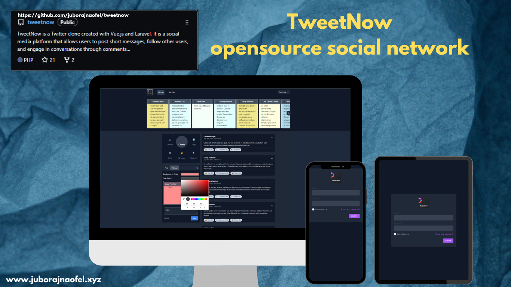

# TweetNow


<p>
    
    TweetNow is an open-source social media platform created with Vue.js + Inertia SSR and Laravel. It allows users to post short messages, follow other users, and engage in conversations through comments and likes.
</p>



<p>
    
    The dashboard provides users with a comprehensive overview of their social media activity. It includes metrics such as follower count, engagement statistics, trending topics, and personalized recommendations based on user behavior.
</p>



<p>
    
    The profile page is where users manage their personal information, including bio, profile picture, and privacy settings. It also displays a timeline of their posts, comments, and interactions with other users.
</p>



<p>
    
    In the settings section, users can customize their experience by adjusting notification preferences, privacy settings, language preferences, and other account-related configurations to personalize their usage.
</p>


<p>
    
    The login screen ensures secure access to the platform, requiring users to enter their credentials (username/email and password) to authenticate their identity and gain entry to their account.
</p>

<p>
    New users can sign up for the platform through the registration screen by providing essential details such as username, email address, and creating a password. It initiates the account creation process for accessing all platform features.
</p>

<p>
    The "forgot password" feature allows users who have forgotten their login credentials to regain access to their account. It typically involves a process to reset the password via email verification or answering security questions for verification.
</p>


## Features

- login, registration and password reset
- Profile view, editing
- Create Post and story
- Follow/Unfollow users
- Search users, (ongoing post search)
- Post Feed
- More changes and features on the way.

## Technologies Used
This project is a web application built with Laravel, utilizing Vue.js and Inertia.js for a modern frontend experience.

## Getting Started

These instructions will guide you to set up a local development environment for TweetNow.

### Prerequisites
- PHP 8.1
- Node.js: Make sure Node.js is installed on your system. ( v18.12.1 )
- Composer: Make sure Composer is installed on your system.
- MySQL: Install and set up a MySQL database server.


### Installation

1. Open a terminal and navigate to the './src/' folder.

2. Install PHP dependencies using Composer:

   ```bash
   composer install
   ```
3. Copy the '.env.example' file and make the required configuration changes in the '.env' file

   ```bash
    cp .env.example .env
   ```
4. Generate an application key:

    ```bash
    php artisan key:generate
    ```
5. Give database credentials to '.env' file and Migrate tables to database by running the below command:

   ```bash
   php artisan migrate
   ```
6. Seed a the database:

   ```bash
   php artisan db:seed
   ```

7. Install JavaScript dependencies using npm:

   ```bash
   npm install
   ```

8. Inside 'tweetnow/src/' In a separate terminal run:

   ```bash
   npm run dev
   ```

9. Inside 'tweetnow/src/' In another terminal run:

   ```bash
   php artisan serve
   ```

   The application should start at this link: http://127.0.0.1:8000/

   If you have seeded the database then you can use this test user credential for testing and development:
   ```
   johndoe@example.com
   password
   ```

## Contribute in this repository
Comming soon ...
